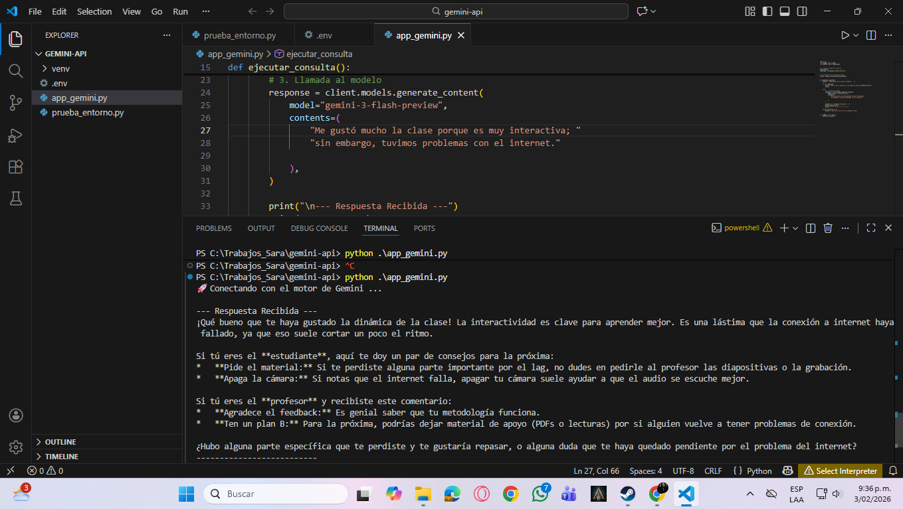

## 1. Clonar el repositorio

## 2. Crear el entorno virtual

    Desde la terminal de VS Code (PowerShell):

    python -m venv venv

## 3. Activar el entorno virtual

    En PowerShell:

    .\venv\Scripts\Activate.ps1

    Si aparece (venv) al inicio de la línea, el entorno está activo.

## 4. Configurar variables de entorno

    Crear un archivo llamado .env en la raíz del proyecto:

    GEMINI_API_KEY=tu_api_key_aqui

     No subir este archivo al repositorio (añádelo al .gitignore).

## 5. Instalar dependencias

    Con el entorno virtual activo:
    
    python -m pip install --upgrade pip
    python -m pip install google-genai python-dotenv requests

## 6. Ejecutar el proyecto
    python main.py
    (ajusta el nombre si tu archivo principal tiene otro nombre)

## 🧪 Evidencia de ejecución

